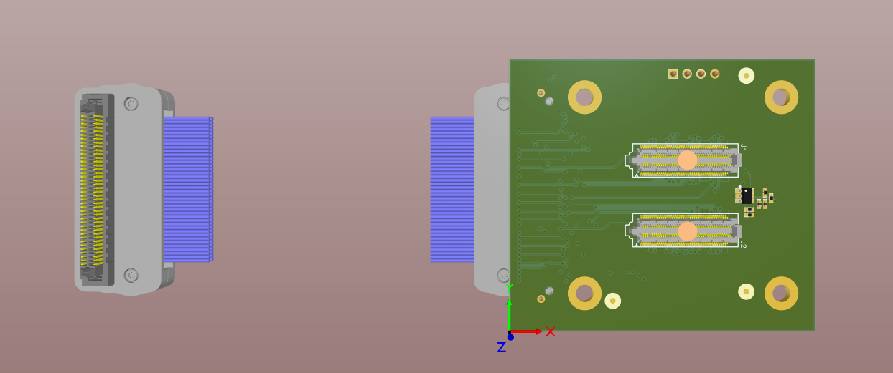

## Hamamatsu S13361-3050AE-08 adapter for DT5550W based boards

 

    

This folder contains the Altium project of the Hamamatsu S13361-3050AE-08 adapter for DT5550W based boards. The designed is released under the MIT license.
You can use this design to build your own custom sensor board or sensor adapter board.